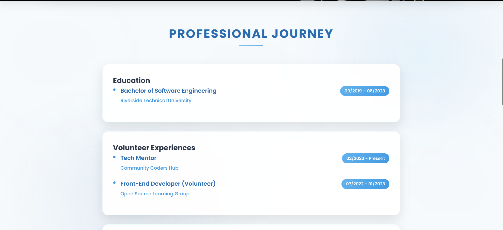
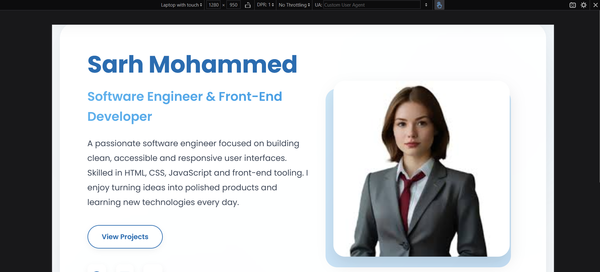

# Personal Portfolio Website

This is my personal portfolio website, built with **HTML, CSS, and JavaScript**,  
with smooth animations powered by the **AOS (Animate On Scroll)** library.  

##  Purpose
The main goal of sharing this code is to help:
- Students and fresh graduates learn how to build a responsive portfolio website.
- Developers get inspiration for their own projects.
- Anyone interested in front-end development understand structure and styling.

##  Usage
You are free to **reuse, modify, or get inspiration** from this project.  
If you find it helpful, a mention or credit would be highly appreciated. 🙌

##  Demo
[Live Website](https://your-portfolio-link.com)

##  Technologies Used
- HTML5  
- CSS3  
- JavaScript  
- AOS Library  
- Font Awesome  

# Portfolio Website

## 🖼️ Preview

### 🔹 Homepage
)

### 🔹 About Section
![About Screenshot]

### 🔹 Skills Section
)

### 🔹 Projects Section
)

## 📱 Responsive Design

| Device      | Screenshot |
|-------------|------------|
| Desktop 💻  | ![Desktop Screenshot] |
| Tablet 📱   | ) |
| Mobile 📲   | ) |

## ⚠️ Disclaimer — Important (EN / AR)

**English:**  
**All personal names, contact details, organizations, and images included in this repository are fictional and used for demonstration only.**  
They do not represent real people or real contact information. Do not treat any of the above as real data.

**العربية:**  
**جميع الأسماء الشخصية ومعلومات الاتصال والمنظمات والصور الموجودة في هذا المستودع وهمية ومستخدمة لأغراض العرض فقط.**  
لا تمثل أي شخص أو جهة حقيقية، ولا تعتبر معلومات للاستخدام الفعلي.

## Contact
- GitHub: [EngllNouf](https://github.com/EngllNouf)  
- LinkedIn: [Nouf Aljedaani](https://linkedin.com/in/nouf-aljedaani-14ba9a284)  
